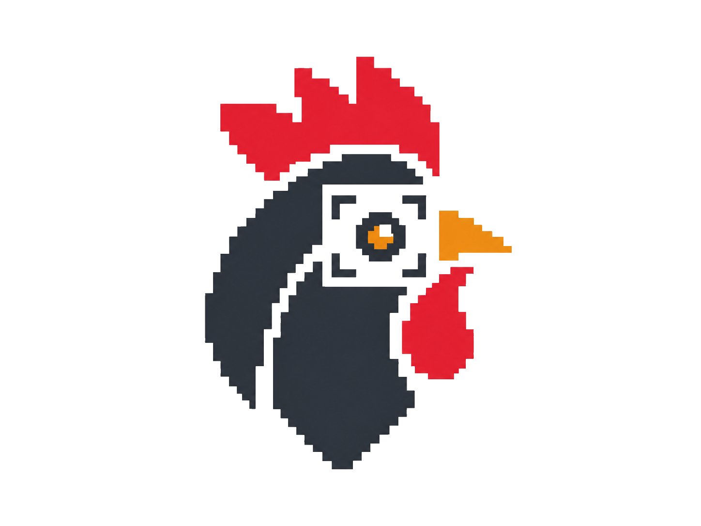

  

# Khoroos

Khoroos (Persian: خروس, pronounced "kho-roos") means "rooster" in Persian.

Khoroos is an open Python toolkit that brings advanced video analysis to poultry welfare monitoring. It provides pretrained detection, tracking, and video action recognition models for computing welfare indicators from raw farm footage.

Models are trained on real production footage and validated across multiple farms.
