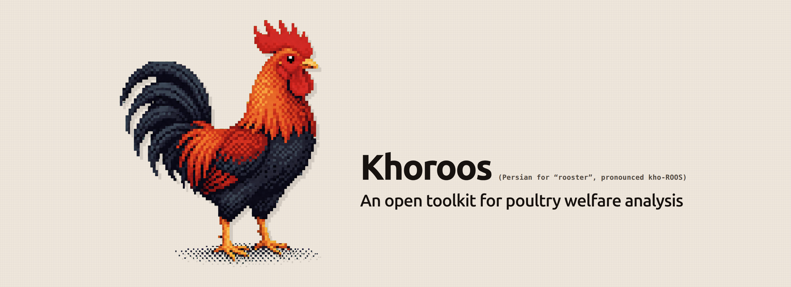

# Khoroos



Khoroos is an open research toolkit for turning poultry-house video into individual bird
tracks, behaviour timelines, and quantitative welfare indicators.

It combines bird detection, multi-object tracking, stable clip extraction, action
classification, and welfare summaries in one reproducible pipeline. You can use it through a
web interface, from the command line, or as a Python library.

## What the pipeline produces

1. Birds are detected in sampled video frames.
2. Detections are linked into tracks with stable identifiers.
3. Each track is divided into short, stable single-bird clips.
4. Clips are classified against the 15-behaviour ChickenAct ethogram.
5. Results are summarized as time budgets, welfare indicators, alerts, and exportable tables.

## Choose an interface

=== "Web interface"

    ```bash
    khoroos ui
    ```

    Upload a video, configure the run, follow its progress, and inspect the result in a browser.

=== "Command line"

    ```bash
    khoroos analyze farm.mp4 --output results/
    ```

    Run repeatable batch analyses and write a complete export bundle.

=== "Python"

    ```python
    from khoroos import analyze_video

    result = analyze_video("farm.mp4", preset="balanced")
    print(result.metrics["indicators"])
    ```

    Integrate the analysis pipeline into notebooks, scripts, or other applications.

!!! warning "Indicators are not diagnoses"

    Khoroos flags patterns in the observed footage. Interpret those patterns with the recording
    conditions, flock context, and model reliability in mind. See
    [Interpreting results](guide/interpreting-results.md) before using outputs in a study or
    operational decision.

[Install Khoroos](getting-started.md){ .md-button .md-button--primary }
[Read the user guide](guide/command-line.md){ .md-button }
